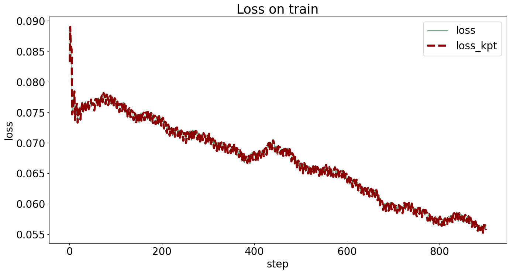

## 创建环境

```shell
# 创建conda环境
conda create -n mmwork python==3.8.16
conda activate mmwork
conda install mamba

# 安装pytorch（根据个人硬件配置，从pytorch选择下载指令）
mamba install pytorch torchvision torchaudio pytorch-cuda=11.8 -c pytorch -c nvidia

# 通过openmim安装mmcv和mmdet
mamba install openmim
mim install mmengine
mim install "mmcv>=2.0.0"
mim install "mmdet>=3.0.0"

# 解压数据集
cd mm/mmhomeworke2
mkdir data
mkdir -p work/result/mmdet
mkdir -p work/result/mmpose
unzip 'data/MMPosehomework.zip' -d 'data/MMPosehomework'
mv 'data/MMPosehomework/样例config配置文件' 'data/MMPosehomework/example'
unzip 'data/MMPosehomework/Ear210_Dataset_coco.zip' -d 'data/MMPosehomework/Ear210_Dataset_coco'

# 准备mmpose和mmdet
cd work
git clone git@github.com:open-mmlab/mmpose.git
git clone git@github.com:open-mmlab/mmdetection.git
cd mmpose
pip install -v -e .
# 以下两行为了避免numpy报错
pip uninstall xtcocotools -y
pip install git+https://github.com/jin-s13/xtcocoapi
# 也是为了解决报错
mamba install scipy
# 同样为了解决报错
pip install -U albumentations --no-binary qudida,albumentations
```

## 修改config文件

打开`rtmdet_tiny_ear.py`和`rtmpose-s-ear.py`

修改以下内容：

```python
data_root = </Absolute/Path/of/Ear210_Keypoint_Dataset_coco/>
TRAIN_BATCH_SIZE = 32
VAL_BATCH_SIZE = 8
```

## 训练模型

```python
# 移动到work/mmdetection目录
cd /media/ders/mazhiming/mm/mmhomeworke2/work/result/mmdet

# 开始训练，CUDA_VISIBLE_DEVICES根据实际情况修改（选用的显卡的编号）
CUDA_VISIBLE_DEVICES=1 PORT=8082 nohup python \
    </Absolute/Path/of/mmdetection/tools/train.py> \
    </Absolute/Path/of/data/MMPosehomework/example/rtmdet_tiny_ear.py> \
    --work-dir </Absolute/Path/of/work/result/mmdet> > output.log 2>&1 &
```

```python
# 移动到work/mmpose目录
cd /media/ders/mazhiming/mm/mmhomeworke2/work/result/mmpose

# 开始训练，CUDA_VISIBLE_DEVICES根据实际情况修改（选用的显卡的编号）
CUDA_VISIBLE_DEVICES=2 PORT=8083 nohup python \
    </Absolute/Path/of/mmpose/tools/train.py> \
    </Absolute/Path/of/data/MMPosehomework/example/rtmpose-s-ear.py> \
    --work-dir </Absolute/Path/of/work/result/mmpose> > output.log 2>&1 &
```

```python
# 中途断开，调参数再训，CUDA_VISIBLE_DEVICES根据实际情况修改（选用的显卡的编号）
CUDA_VISIBLE_DEVICES=2 PORT=8083 nohup python \
    </Absolute/Path/of/mmpose/tools/train.py> \
    </Absolute/Path/of/data/MMPosehomework/example/rtmpose-s-ear.py> \
    --work-dir </Absolute/Path/of/work/result/mmpose> \
    --resume </Absolute/Path/of/pth> > output.log 2>&1 &
```

## 评估结果

### 日志分析

#### MMdet (epoch200 + epoch200)

>   Average Precision  (AP) @[ IoU=0.50:0.95 | area=  all | maxDets=100 ] = 0.822
>
>   Average Precision  (AP) @[ IoU=0.50    | area=  all | maxDets=100 ] = 0.967
>
>   Average Precision  (AP) @[ IoU=0.75    | area=  all | maxDets=100 ] = 0.967
>
>   Average Precision  (AP) @[ IoU=0.50:0.95 | area= small | maxDets=100 ] = -1.000
>
>   Average Precision  (AP) @[ IoU=0.50:0.95 | area=medium | maxDets=100 ] = -1.000
>
>   Average Precision  (AP) @[ IoU=0.50:0.95 | area= large | maxDets=100 ] = 0.822
>
>   Average Recall   (AR) @[ IoU=0.50:0.95 | area=  all | maxDets=  1 ] = 0.857
>
>   Average Recall   (AR) @[ IoU=0.50:0.95 | area=  all | maxDets= 10 ] = 0.857
>
>   Average Recall   (AR) @[ IoU=0.50:0.95 | area=  all | maxDets=100 ] = 0.857
>
>   Average Recall   (AR) @[ IoU=0.50:0.95 | area= small | maxDets=100 ] = -1.000
>
>   Average Recall   (AR) @[ IoU=0.50:0.95 | area=medium | maxDets=100 ] = -1.000
>
>   Average Recall   (AR) @[ IoU=0.50:0.95 | area= large | maxDets=100 ] = 0.857
>
> 06/07 02:36:16 - mmengine - INFO - bbox_mAP_copypaste: 0.822 0.967 0.967 -1.000 -1.000 0.822
>
> 06/07 02:36:16 - mmengine - INFO - Epoch(val) [200][6/6]   coco/bbox_mAP: 0.8220  coco/bbox_mAP_50: 0.9670  coco/bbox_mAP_75: 0.9670  coco/bbox_mAP_s: -1.0000  coco/bbox_mAP_m: -1.0000  coco/bbox_mAP_l: 0.8220  data_time: 0.9648  time: 1.0142


#### MMpose (epoch150 + lr调小为80%的epoch150)

>   Average Precision  (AP) @[ IoU=0.50:0.95 | area=  all | maxDets= 20 ] =  0.708
>
>   Average Precision  (AP) @[ IoU=0.50    | area=  all | maxDets= 20 ] =  1.000
>
>   Average Precision  (AP) @[ IoU=0.75    | area=  all | maxDets= 20 ] =  0.860
>
>   Average Precision  (AP) @[ IoU=0.50:0.95 | area=medium | maxDets= 20 ] = -1.000
>
>   Average Precision  (AP) @[ IoU=0.50:0.95 | area= large | maxDets= 20 ] =  0.708
>
>   Average Recall   (AR) @[ IoU=0.50:0.95 | area=  all | maxDets= 20 ] =  0.745
>
>   Average Recall   (AR) @[ IoU=0.50    | area=  all | maxDets= 20 ] =  1.000
>
>   Average Recall   (AR) @[ IoU=0.75    | area=  all | maxDets= 20 ] =  0.881
>
>   Average Recall   (AR) @[ IoU=0.50:0.95 | area=medium | maxDets= 20 ] = -1.000
>
>   Average Recall   (AR) @[ IoU=0.50:0.95 | area= large | maxDets= 20 ] =  0.745
>
> 06/07 02:26:24 - mmengine - INFO - Evaluating PCKAccuracy (normalized by ``"bbox_size"``)...
>
> 06/07 02:26:24 - mmengine - INFO - Evaluating AUC...
>
> 06/07 02:26:24 - mmengine - INFO - Evaluating NME...
>
> 06/07 02:26:24 - mmengine - INFO - Epoch(val) [150][6/6]   coco/AP: 0.708495  coco/AP .5: 1.000000  coco/AP .75: 0.859583  coco/AP (M): -1.000000  coco/AP (L): 0.708495  coco/AR: 0.745238  coco/AR .5: 1.000000  coco/AR .75: 0.880952  coco/AR (M): -1.000000  coco/AR (L): 0.745238  PCK: 0.963719  AUC: 0.127494  NME: 0.043727  data_time: 1.753416  time: 1.782141




### 可视化

<div>
    <div style="float: left; width: 50%;">
        <div style="width: 100%;">
    		
        </div>
        <div style="width: 100%;">
            
        </div>
    </div>
    <div style="float: right; width: 50%;">
        <div style="width: 100%;">
            
        </div>
    </div>
</div>


> ```shell
> # mmdet单图推理，CUDA_VISIBLE_DEVICES根据实际情况修改（选用的显卡的编号）
> CUDA_VISIBLE_DEVICES=1 PORT=8082 python \
> 	<path/to/mmdetection/demo/image_demo.py> \
> 	<path/to/test_ear.jpg> \
>     <path/to/rtmdet_tiny_ear.py> \
> 	--weights <path/to/best/mmdet/pth> \
> 	--out-dir <path/to/output/directory> \
> 	--device <cpu or cuda or cuda:0 …… > \
> 	> output.log 2>&1
> ```
>
> ```shell
> # mmpose单图推理，CUDA_VISIBLE_DEVICES根据实际情况修改（选用的显卡的编号）
> CUDA_VISIBLE_DEVICES=1 PORT=8082 python \
> 	<path/to/mmpose/demo/image_demo.py> \
> 	<path/to/rtmdet_tiny_ear.py> \
> 	<path/to/best/mmdet/pth> \
>     <path/to/rtmpose-s-ear.py> \
> 	<path/to/best/mmpose/pth> \
> 	--input <path/to/test_ear.jpg> \
> 	--output-root <path/to/output/directory> \
> 	--save-predictions \
> 	--device <cpu or cuda or cuda:0 …… > \
> 	--bbox-thr 0.5 \
>     --kpt-thr 0.5 \
>     --nms-thr 0.3 \
>     --radius 8 \
>     --thickness 7 \
>     --draw-bbox \
>     --draw-heatmap \
>     --show-kpt-idx \
> 	> output.log 2>&1
> ```

参考资料：

mmdet

- https://mmdetection.readthedocs.io/zh_CN/latest/user_guides/inference.html

mmpose:

- https://mmpose.readthedocs.io/zh_CN/latest/demos.html
- https://mmpose.readthedocs.io/zh_CN/latest/user_guides/inference.html（参数设置）

## 遇到的坑

### 环境配置

> ```python
> # 以下两行为了避免numpy报错
> pip uninstall xtcocotools -y
> pip install git+https://github.com/jin-s13/xtcocoapi
> # 也是为了解决报错
> mamba install scipy
> # 同样为了解决报错
> pip install -U albumentations --no-binary qudida,albumentations
> ```

从上往下依次来自

1. [Numpy error · Issue #2195 · open-mmlab/mmpose · GitHub](https://github.com/open-mmlab/mmpose/issues/2195)
2. 自行解决
3. https://github.com/open-mmlab/mmpose/pull/1184

### 创建Config的方法

第一次自定义config时，可以从源码的`configs`文件夹中自行选择组件进行组装再使用，使用无论成功与否，都会在工作目录下生成完整的config，可以基于这个config再进行修改

### Config参数设置

MMpose示例config的默认参数中，CosineAnnealingLR开始的epoch偏晚（150epoch），调早一些效果可能更好

### 调试Config的方法

```shell
CUDA_VISIBLE_DEVICES=1 PORT=8082 python \
	<your_command> \
	> output.log 2>&1
```

在终端以此格式调用命令，运行日志打印到当前目录下，并且可以根据终端状态检查命令是否仍存活
